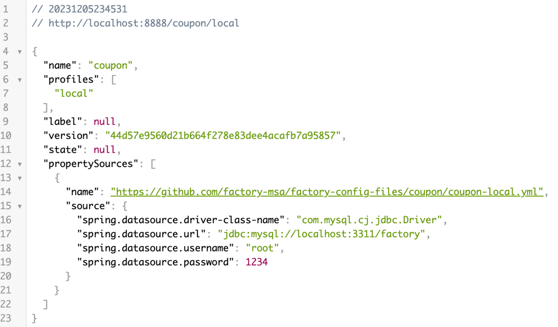
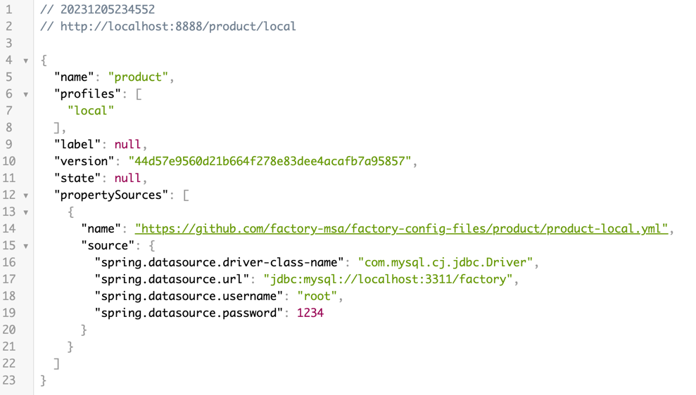

## Factory Config Server

### Config
- 분산 시스템에서 외부 설정 정보를 여러 서버 및 클라이언트에게 제공하는 서비스
- Config Server 는 외부에 제공하는 모든 환경에 대한 정보들을 관리하는 중앙 서버

### How to run
```shell
1. git clone https://github.com/factory-msa/factory-config.git
2. ./gradlew build
3.
  - http://localhost:8888/coupon/local
  - http://localhost:8888/product/local
  - http://localhost:8888/issuance/local
```






<br>


- https://mangkyu.tistory.com/253
